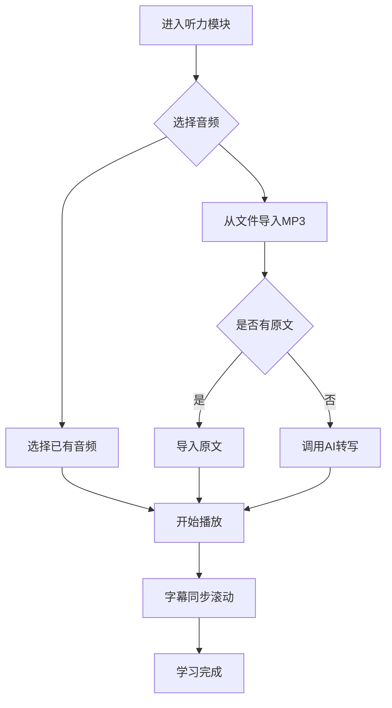
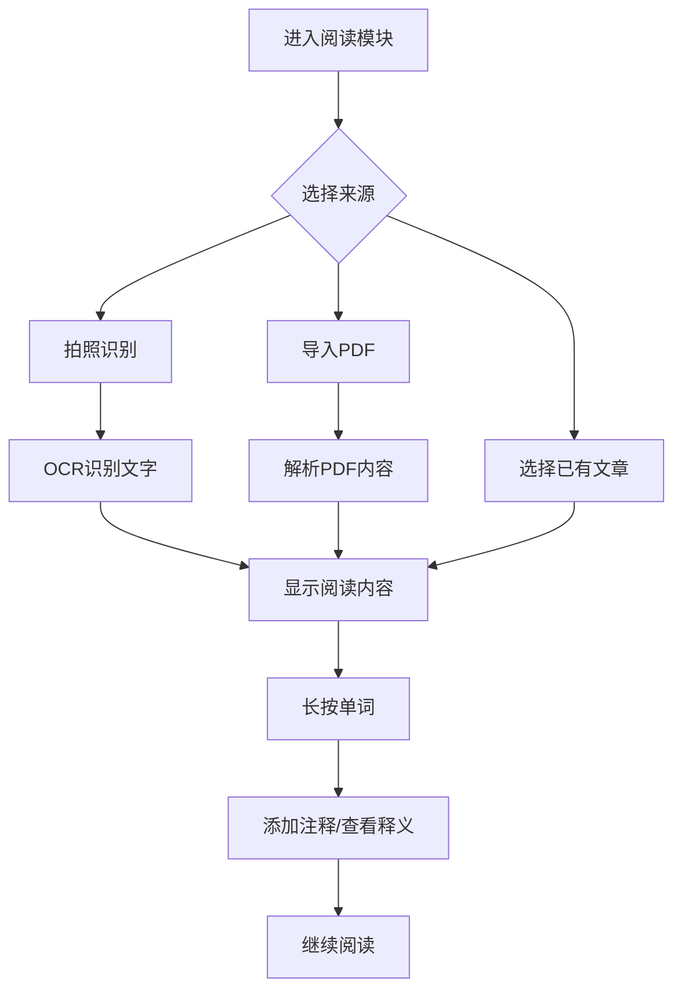
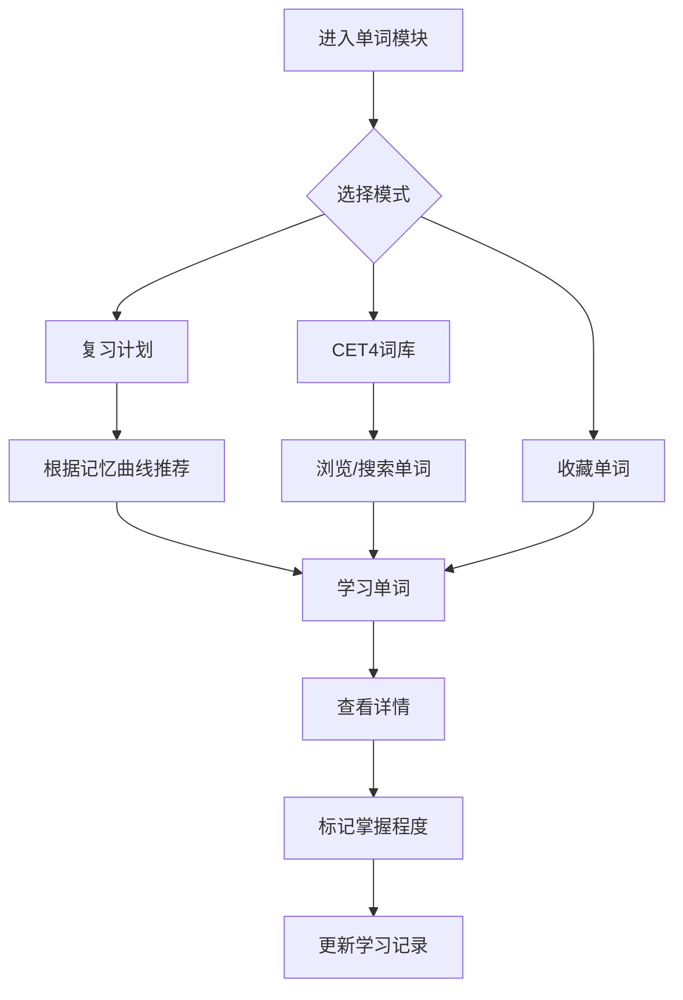

# 英语学习APP - 产品需求文档

---

## 1. 文档信息

| 项目 | 内容 |
|------|------|
| **产品名称** | 英语学习助手 |
| **版本** | v1.0.0 |
| **平台** | Android |
| **目标用户** | 英语学习者（CET4备考人群为主） |
| **创建日期** | 2026-05-06 |

---

## 2. 产品概述

### 2.1 产品定位

一款专注于英语学习的移动应用，整合**听力训练**、**阅读训练**和**单词记忆**三大核心功能，通过AI技术提升学习效率，帮助用户高效备考CET4及日常英语学习。

### 2.2 核心价值

- **一站式学习**：整合听力、阅读、单词三大模块
- **AI辅助**：利用大模型实现音频转写、智能翻译
- **个性化记忆**：基于用户学习行为的智能复习计划
- **多格式支持**：支持MP3、拍照、PDF等多种内容导入方式

---

## 3. 功能需求

### 3.1 听力模块

| 功能 | 描述 | 优先级 |
|------|------|--------|
| MP3导入 | 用户可从本地文件系统选择MP3文件导入 | 高 |
| 原文关联 | 支持导入听力原文文本文件（.txt） | 高 |
| AI语音转写 | 调用大模型API将音频转写为文字 | 高 |
| 字幕滚动 | 播放音频时，文字随进度高亮滚动显示 | 高 |
| 播放控制 | 播放/暂停、快进/快退、进度条拖动 | 高 |
| 变速播放 | 支持0.5x-2.0x多档语速调节 | 中 |
| 循环播放 | 支持单曲循环和段落循环 | 中 |

### 3.2 阅读模块

| 功能 | 描述 | 优先级 |
|------|------|--------|
| 拍照识别 | 使用相机拍照，通过OCR识别文字 | 高 |
| PDF导入 | 支持从本地导入PDF文件 | 高 |
| 文字显示 | 清晰展示阅读内容，支持字体大小调整 | 高 |
| 单词注释 | 长按单词添加自定义注释，支持删除编辑 | 高 |
| 单词释义 | 点击单词快速查看释义（调用词库） | 高 |
| 阅读进度 | 记录阅读进度，支持断点续读 | 中 |
| 夜间模式 | 支持深色/浅色主题切换 | 中 |

### 3.3 单词模块

| 功能 | 描述 | 优先级 |
|------|------|--------|
| CET4词库 | 内置CET4全部单词（约4500个） | 高 |
| 关联记忆 | 自动关联听力/阅读中遇到的单词 | 高 |
| 智能复习 | 基于艾宾浩斯记忆曲线制定复习计划 | 高 |
| 单词详情 | 显示单词释义、音标、例句、词性 | 高 |
| 单词收藏 | 支持收藏重点单词 | 中 |
| 学习统计 | 统计学习进度、掌握程度 | 中 |

---

## 4. 非功能需求

### 4.1 性能要求

| 指标 | 要求 |
|------|------|
| 启动时间 | < 2秒 |
| 音频加载 | < 1秒 |
| OCR识别 | < 3秒 |
| PDF渲染 | < 5秒（100页内） |

### 4.2 适配要求

| 项目 | 要求 |
|------|------|
| Android版本 | 支持Android 8.0+（API 26+） |
| 屏幕尺寸 | 支持手机（4.7"-6.8"）、平板 |
| 分辨率 | 支持hdpi、xhdpi、xxhdpi、xxxhdpi |

### 4.3 安全性

- 用户数据本地存储，不上传服务器
- 敏感数据加密处理
- 权限申请明确告知用户用途

---

## 5. 用户流程

### 5.1 听力学习流程



### 5.2 阅读学习流程



### 5.3 单词学习流程



---

## 6. 数据模型

### 6.1 数据库表设计

#### 6.1.1 Audio（音频表）

| 字段 | 类型 | 约束 | 说明 |
|------|------|------|------|
| id | INTEGER | PRIMARY KEY AUTOINCREMENT | 主键 |
| name | TEXT | NOT NULL | 音频名称 |
| path | TEXT | NOT NULL | 文件路径 |
| duration | INTEGER | | 时长（毫秒） |
| transcript | TEXT | | 转写文本 |
| created_at | TIMESTAMP | DEFAULT CURRENT_TIMESTAMP | 创建时间 |

#### 6.1.2 Reading（阅读表）

| 字段 | 类型 | 约束 | 说明 |
|------|------|------|------|
| id | INTEGER | PRIMARY KEY AUTOINCREMENT | 主键 |
| title | TEXT | | 标题 |
| content | TEXT | NOT NULL | 内容 |
| source_type | INTEGER | NOT NULL | 来源类型（拍照/PDF/其他） |
| source_path | TEXT | | 源文件路径 |
| progress | INTEGER | DEFAULT 0 | 阅读进度（字符位置） |
| created_at | TIMESTAMP | DEFAULT CURRENT_TIMESTAMP | 创建时间 |

#### 6.1.3 Annotation（注释表）

| 字段 | 类型 | 约束 | 说明 |
|------|------|------|------|
| id | INTEGER | PRIMARY KEY AUTOINCREMENT | 主键 |
| reading_id | INTEGER | FOREIGN KEY | 关联阅读ID |
| word | TEXT | NOT NULL | 单词 |
| definition | TEXT | | 释义 |
| note | TEXT | | 用户注释 |
| position | INTEGER | | 在文章中的位置 |

#### 6.1.4 Word（单词表）

| 字段 | 类型 | 约束 | 说明 |
|------|------|------|------|
| id | INTEGER | PRIMARY KEY AUTOINCREMENT | 主键 |
| word | TEXT | NOT NULL UNIQUE | 单词 |
| phonetic | TEXT | | 音标 |
| meaning | TEXT | NOT NULL | 释义 |
| part_of_speech | TEXT | | 词性 |
| example | TEXT | | 例句 |
| level | INTEGER | DEFAULT 1 | 难度等级（1-5） |

#### 6.1.5 WordLearning（单词学习记录表）

| 字段 | 类型 | 约束 | 说明 |
|------|------|------|------|
| id | INTEGER | PRIMARY KEY AUTOINCREMENT | 主键 |
| word_id | INTEGER | FOREIGN KEY | 关联单词ID |
| encounter_count | INTEGER | DEFAULT 1 | 遇到次数 |
| last_encounter_at | TIMESTAMP | | 最后遇到时间 |
| mastery_level | INTEGER | DEFAULT 0 | 掌握程度（0-5） |
| next_review_at | TIMESTAMP | | 下次复习时间 |
| created_at | TIMESTAMP | DEFAULT CURRENT_TIMESTAMP | 创建时间 |

---

## 7. API接口设计

### 7.1 大模型语音转写接口

| 项目 | 内容 |
|------|------|
| **方法** | POST |
| **URL** | `/api/transcribe` |
| **Content-Type** | multipart/form-data |

**请求参数：**

| 参数 | 类型 | 必填 | 说明 |
|------|------|------|------|
| audio | File | 是 | MP3音频文件 |

**响应结构：**

```json
{
  "success": true,
  "data": {
    "transcript": "音频转写的文本内容..."
  },
  "message": "转写成功"
}
```

### 7.2 单词释义查询接口

| 项目 | 内容 |
|------|------|
| **方法** | GET |
| **URL** | `/api/word/{word}` |

**响应结构：**

```json
{
  "success": true,
  "data": {
    "word": "example",
    "phonetic": "/ɪɡˈzɑːmpl/",
    "meaning": "n. 例子；榜样 adj. 模范的；作例证用的",
    "part_of_speech": "noun/adj",
    "example": "This is a good example."
  },
  "message": "查询成功"
}
```

---

## 8. UI/UX设计

### 8.1 设计原则

1. **简洁清晰**：界面简洁，信息层次分明
2. **直观交互**：操作流程直观，降低学习成本
3. **响应式设计**：适配多种屏幕尺寸
4. **视觉反馈**：操作有明确反馈，提升安全感

### 8.2 页面结构

| 页面 | 功能 | 入口 |
|------|------|------|
| 首页 | 功能入口导航、学习统计 | App启动 |
| 听力列表 | 显示已导入的音频列表 | 首页"听力"图标 |
| 听力播放 | 音频播放、字幕滚动 | 点击音频项 |
| 阅读列表 | 显示已导入的阅读材料 | 首页"阅读"图标 |
| 阅读详情 | 阅读内容、单词注释 | 点击阅读项 |
| 单词列表 | CET4词库浏览、搜索 | 首页"单词"图标 |
| 单词详情 | 单词释义、例句、收藏 | 点击单词项 |
| 复习计划 | 待复习单词列表 | 首页"复习"入口 |

### 8.3 交互设计

#### 8.3.1 听力播放页

- **播放控制区**：播放/暂停按钮、进度条、时间显示
- **字幕显示区**：当前播放行高亮，已播放内容灰色显示
- **语速调节**：底部滑动条或档位选择
- **循环模式**：点击切换单曲/段落循环

#### 8.3.2 阅读详情页

- **内容展示**：清晰的文字排版，支持字体大小调整
- **单词交互**：长按单词弹出操作菜单（添加注释/查看释义）
- **注释标记**：已添加注释的单词有特殊标记

#### 8.3.3 单词卡片

- **正面**：显示单词、音标、词性
- **背面**：显示释义、例句
- **操作**：标记掌握程度、添加收藏

---

## 9. 开发计划

### 9.1 迭代规划

| 阶段 | 时间 | 内容 |
|------|------|------|
| Phase 1 | 2周 | 项目初始化、基础架构搭建 |
| Phase 2 | 3周 | 听力模块开发（MP3播放、字幕滚动） |
| Phase 3 | 3周 | 阅读模块开发（拍照、PDF、注释） |
| Phase 4 | 2周 | 单词模块开发（CET4词库、复习计划） |
| Phase 5 | 1周 | 集成测试、适配优化 |

### 9.2 里程碑

| 里程碑 | 交付物 |
|--------|--------|
| M1 | 项目框架、数据库设计完成 |
| M2 | 听力模块功能完成 |
| M3 | 阅读模块功能完成 |
| M4 | 单词模块功能完成 |
| M5 | 测试通过、发布beta版 |

---

## 10. 附录

### 10.1 权限需求

| 权限 | 用途 |
|------|------|
| READ_EXTERNAL_STORAGE | 读取本地MP3/PDF文件 |
| WRITE_EXTERNAL_STORAGE | 保存下载的文件 |
| CAMERA | 拍照识别功能 |
| RECORD_AUDIO | （可选）录音功能 |
| INTERNET | 调用大模型API |

### 10.2 数据统计指标

| 指标 | 说明 |
|------|------|
| 每日学习时长 | 用户每日使用APP的时长 |
| 单词学习数量 | 每日学习/复习的单词数 |
| 听力完成数 | 完成的听力练习数量 |
| 阅读完成数 | 完成的阅读材料数量 |
| 单词掌握率 | 标记为已掌握的单词比例 |

---

**文档版本**：v1.0.0  
**创建人**：AI Assistant  
**创建日期**：2026-05-06
